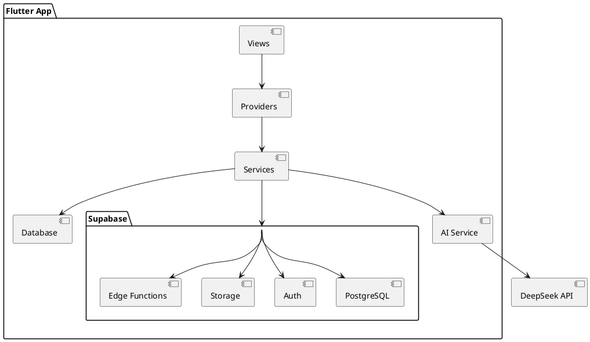

# 项目总体设计

> **版本**: V1.0 | **日期**: 2026-07-12
> **状态**: 当前有效

---

## 一、产品定位

**VidLang** - 视频语言学习应用

**目标用户**：英语学习者
**核心价值**：通过视频、文章、歌曲三种媒介学习英语
**差异化**：字幕查词 + 跟读评分 + AI 问答

---

## 二、技术架构

### 2.1 架构模式

**Flutter 单仓架构（Monorepo）**

```
选择原因：
1. 多学习引擎（视频/文章/歌曲）共享同一套学习引擎代码
2. 本地数据库与云端 Supabase 强耦合
3. 团队规模适中，统一管理成本低
```

### 2.2 技术栈

| 层级 | 技术 | 选型理由 |
|------|------|----------|
| 前端框架 | Flutter 3.x | 跨平台、高性能 |
| 状态管理 | Riverpod | 类型安全、可测试性 |
| 本地数据库 | SQLite + FTS5 | 离线优先、全文检索 |
| 视频播放 | OmniPlayer | 自研、可控 |
| UI 组件库 | TDesign | 企业级、设计规范 |
| 后端服务 | Supabase | 快速开发、成本低 |
| AI 服务 | DeepSeek | 性价比高 |

### 2.3 架构图



---

## 三、三引擎架构

### 3.1 视频引擎

**核心功能**：
- 字幕查词
- 跟读评分
- 重复播放

**数据模型**：
- VideoFolder（视频集）
- VideoInfo（视频信息）
- Subtitles（字幕）
- Participle（分词）

### 3.2 文章引擎

**核心功能**：
- 文章阅读
- 生词本
- 阅读测试

**数据模型**：
- Article（文章）
- ArticleWord（文章单词）
- WordBook（单词本）

### 3.3 歌曲引擎

**核心功能**：
- 歌词同步
- 听歌学英语
- 歌曲测试

**数据模型**：
- Song（歌曲）
- SongLyrics（歌词）
- SongWord（歌曲单词）

---

## 四、产品矩阵

```
VidLang 产品矩阵
├── VidLang App（主应用）
│   ├── 视频学习
│   ├── 文章阅读
│   ├── 歌曲学习
│   └── AI 问答
│
├── Supabase 后端
│   ├── 用户认证
│   ├── 数据同步
│   ├── 文件存储
│   └── Edge Functions
│
└── 管理后台（未来）
    ├── 内容管理
    ├── 用户管理
    └── 数据分析
```

---

## 五、开发阶段

### Phase 1: 视频闭环

**目标**：完成视频学习核心功能

**任务**：
- [ ] 录音功能
- [ ] 字幕查词
- [ ] 跟读评分
- [ ] 重复播放

### Phase 2: 文章阅读

**目标**：完成文章阅读功能

**任务**：
- [ ] Article 模型
- [ ] 文章阅读页面
- [ ] 生词本
- [ ] 阅读测试

### Phase 3: 歌曲学习

**目标**：完成歌曲学习功能

**任务**：
- [ ] Song 模型
- [ ] 歌词同步
- [ ] 听歌学英语
- [ ] 歌曲测试

### Phase 4: 云端同步

**目标**：完成 Supabase 集成

**任务**：
- [ ] 用户认证
- [ ] 数据同步
- [ ] AI 问答

---

## 六、关键决策

### 6.1 为什么选择单仓架构？

**优点**：
- 代码共享，减少重复
- 统一管理，降低复杂度
- 方便协作，减少冲突

**缺点**：
- 代码量大，编译慢
- 模块耦合，难以独立部署

**结论**：对于 VidLang 这个项目，优点大于缺点。

### 6.2 为什么选择 Supabase？

**优点**：
- 快速开发，降低后端成本
- 实时同步，用户体验好
- 认证集成，安全可靠

**缺点**：
- 供应商锁定
- 定制性有限

**结论**：对于 VidLang 这个项目，Supabase 足够满足需求。

---

**文档版本**：V1.0
**创建时间**：2026-07-12
