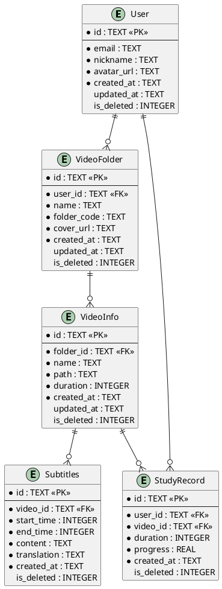

# 数据库设计模板

> **版本**: V1.0 | **日期**: YYYY-MM-DD
> **状态**: 草稿/评审中/已批准

---

## 一、设计概述

### 1.1 设计目标

[描述数据库设计的目标]

### 1.2 设计原则

- **离线优先**：本地 SQLite 为主
- **云端同步**：Supabase 为辅
- **软删除**：支持数据恢复
- **审计字段**：created_at, updated_at, is_deleted

---

## 二、实体关系图



---

## 三、表结构定义

### 3.1 用户表 (user)

```sql
CREATE TABLE user (
  id TEXT PRIMARY KEY,
  email TEXT NOT NULL UNIQUE,
  nickname TEXT NOT NULL,
  avatar_url TEXT,
  created_at TEXT NOT NULL,
  updated_at TEXT,
  is_deleted INTEGER DEFAULT 0
);

-- 索引
CREATE INDEX idx_user_email ON user(email);
CREATE INDEX idx_user_is_deleted ON user(is_deleted);
```

### 3.2 视频集表 (video_folder)

```sql
CREATE TABLE video_folder (
  id TEXT PRIMARY KEY,
  user_id TEXT NOT NULL,
  name TEXT NOT NULL,
  folder_code TEXT NOT NULL,
  cover_url TEXT,
  created_at TEXT NOT NULL,
  updated_at TEXT,
  is_deleted INTEGER DEFAULT 0,
  FOREIGN KEY (user_id) REFERENCES user(id)
);

-- 索引
CREATE INDEX idx_video_folder_user_id ON video_folder(user_id);
CREATE INDEX idx_video_folder_folder_code ON video_folder(folder_code);
CREATE INDEX idx_video_folder_is_deleted ON video_folder(is_deleted);
```

### 3.3 视频信息表 (video_info)

```sql
CREATE TABLE video_info (
  id TEXT PRIMARY KEY,
  folder_id TEXT NOT NULL,
  name TEXT NOT NULL,
  path TEXT NOT NULL,
  duration INTEGER NOT NULL,
  created_at TEXT NOT NULL,
  updated_at TEXT,
  is_deleted INTEGER DEFAULT 0,
  FOREIGN KEY (folder_id) REFERENCES video_folder(id)
);

-- 索引
CREATE INDEX idx_video_info_folder_id ON video_info(folder_id);
CREATE INDEX idx_video_info_is_deleted ON video_info(is_deleted);
```

### 3.4 字幕表 (subtitles)

```sql
CREATE TABLE subtitles (
  id TEXT PRIMARY KEY,
  video_id TEXT NOT NULL,
  start_time INTEGER NOT NULL,
  end_time INTEGER NOT NULL,
  content TEXT NOT NULL,
  translation TEXT,
  created_at TEXT NOT NULL,
  is_deleted INTEGER DEFAULT 0,
  FOREIGN KEY (video_id) REFERENCES video_info(id)
);

-- 索引
CREATE INDEX idx_subtitles_video_id ON subtitles(video_id);
CREATE INDEX idx_subtitles_time ON subtitles(start_time, end_time);
CREATE INDEX idx_subtitles_is_deleted ON subtitles(is_deleted);

-- FTS5 全文检索
CREATE VIRTUAL TABLE subtitles_fts USING fts5(
  content,
  content='subtitles',
  content_rowid='rowid'
);
```

### 3.5 学习记录表 (study_record)

```sql
CREATE TABLE study_record (
  id TEXT PRIMARY KEY,
  user_id TEXT NOT NULL,
  video_id TEXT NOT NULL,
  duration INTEGER NOT NULL,
  progress REAL NOT NULL,
  created_at TEXT NOT NULL,
  is_deleted INTEGER DEFAULT 0,
  FOREIGN KEY (user_id) REFERENCES user(id),
  FOREIGN KEY (video_id) REFERENCES video_info(id)
);

-- 索引
CREATE INDEX idx_study_record_user_id ON study_record(user_id);
CREATE INDEX idx_study_record_video_id ON study_record(video_id);
CREATE INDEX idx_study_record_is_deleted ON study_record(is_deleted);
```

---

## 四、字段规范

### 4.1 通用字段

| 字段 | 类型 | 说明 | 示例 |
|------|------|------|------|
| id | TEXT | UUID 主键 | `"550e8400-e29b-41d4-a716-446655440000"` |
| created_at | TEXT | ISO8601 创建时间 | `"2026-07-12T10:00:00Z"` |
| updated_at | TEXT | ISO8601 更新时间 | `"2026-07-12T10:00:00Z"` |
| is_deleted | INTEGER | 软删除标记 | `0` 或 `1` |

### 4.2 时长字段

| 字段 | 单位 | 说明 |
|------|------|------|
| duration (视频) | 毫秒 | 视频时长 |
| duration (学习记录) | 秒 | 学习时长 |
| start_time | 毫秒 | 字幕开始时间 |
| end_time | 毫秒 | 字幕结束时间 |

### 4.3 命名规范

| 类型 | 规范 | 示例 |
|------|------|------|
| 表名 | snake_case | `video_folder` |
| 字段名 | snake_case | `folder_code` |
| 索引名 | idx_{表名}_{字段名} | `idx_video_folder_user_id` |

---

## 五、FTS5 全文检索

### 5.1 字幕全文检索

```sql
-- 创建 FTS5 虚拟表
CREATE VIRTUAL TABLE subtitles_fts USING fts5(
  content,
  content='subtitles',
  content_rowid='rowid'
);

-- 触发器：保持同步
CREATE TRIGGER subtitles_ai AFTER INSERT ON subtitles BEGIN
  INSERT INTO subtitles_fts(rowid, content) VALUES (new.rowid, new.content);
END;

CREATE TRIGGER subtitles_ad AFTER DELETE ON subtitles BEGIN
  INSERT INTO subtitles_fts(subtitles_fts, rowid, content) VALUES('delete', old.rowid, old.content);
END;

CREATE TRIGGER subtitles_au AFTER UPDATE ON subtitles BEGIN
  INSERT INTO subtitles_fts(subtitles_fts, rowid, content) VALUES('delete', old.rowid, old.content);
  INSERT INTO subtitles_fts(rowid, content) VALUES (new.rowid, new.content);
END;
```

### 5.2 查询示例

```sql
-- 全文检索
SELECT * FROM subtitles WHERE content MATCH '查询词';

-- 带排名的检索
SELECT *, rank FROM subtitles WHERE content MATCH '查询词' ORDER BY rank;

-- 片段检索
SELECT snippet(subtitles_fts, 0, '<b>', '</b>', '...', 32) FROM subtitles_fts WHERE content MATCH '查询词';
```

---

## 六、迁移策略

### 6.1 版本管理

```
supabase/migrations/
├── 001_initial_schema.sql
├── 002_add_article_table.sql
├── 003_add_song_table.sql
└── ...
```

### 6.2 迁移脚本模板

```sql
-- Migration: {描述}
-- Date: YYYY-MM-DD
-- Author: {作者}

BEGIN;

-- 1. 创建新表
CREATE TABLE new_table (
  id TEXT PRIMARY KEY,
  -- ...
);

-- 2. 迁移数据
INSERT INTO new_table (id, -- ...)
SELECT id, -- ...
FROM old_table;

-- 3. 删除旧表
DROP TABLE old_table;

-- 4. 重命名
ALTER TABLE new_table RENAME TO old_table;

COMMIT;
```

---

## 七、性能优化

### 7.1 索引策略

- **主键索引**：自动创建
- **外键索引**：所有外键字段
- **查询索引**：高频查询字段
- **复合索引**：多字段查询

### 7.2 查询优化

```sql
-- 避免 SELECT *
SELECT id, name, created_at FROM video_folder WHERE user_id = ?;

-- 使用 LIMIT
SELECT * FROM video_info WHERE folder_id = ? LIMIT 20;

-- 避免 OR，使用 UNION
SELECT * FROM video_info WHERE folder_id = 'a'
UNION
SELECT * FROM video_info WHERE folder_id = 'b';
```

---

**文档版本**：V1.0
**创建时间**：YYYY-MM-DD
**最后更新**：YYYY-MM-DD
